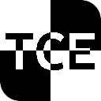

<div align="center">


<br />
<br />

[](https://crates.io/crates/tce)

<br />

---

**A Terrible Chess Engine.**
<br/>

</div>

# TL;DR

TCE is a Terrible Chess Engine that was created as a personal project to learn how chess engines work.

# Installation

You can install binaries from [here][https://github.com/Nikto220/tce/releases].
You can also run:
```
cargo install tce
```
But remember that cargo will compile the non-PEXT version without any flags, so if you want the PEXT version and you have a BMI2 CPU, you can set your rust compiler flags through `RUSTFLAGS="-C target-cpu=native"` (or `$env:RUSTFLAGS="-C target-cpu=native"` if you use powershell).

# Contributing

I probably won't accept PRs, but if you find any issues, feel free to report them!

# License

TCE is dual licensed under either MIT or Apache 2.0, at your option.
